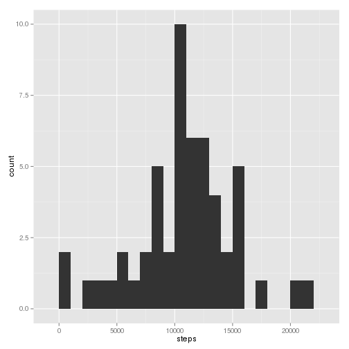
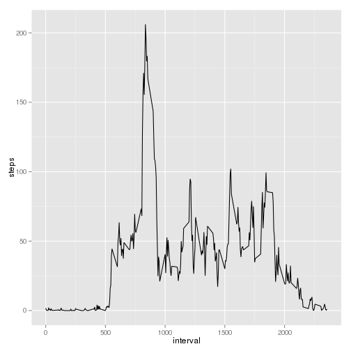
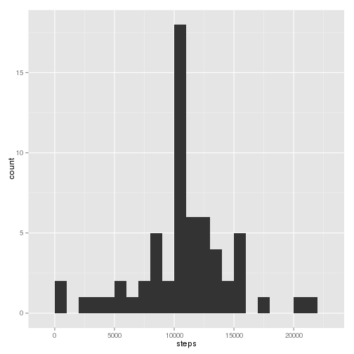
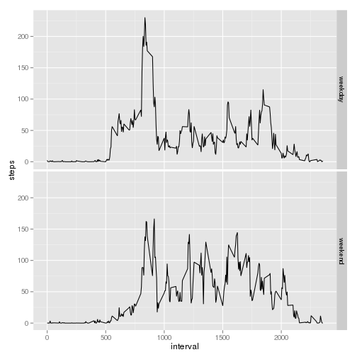

# Reproducible Research: Peer Assessment 1


## Loading and preprocessing the data


```r
datRaw <- read.table("activity.csv", header = TRUE, sep = ",", colClasses = c("numeric", 
    "Date", "integer"))
```


## What is mean total number of steps taken per day?


```r
library(ggplot2)
myTbyDay <- aggregate(steps ~ date, data = datRaw, FUN = "sum", na.action = "na.omit")
ggplot(myTbyDay, aes(x = steps)) + geom_histogram(binwidth = 1000)
```

 


```r
mean(myTbyDay$steps)
```

```
## [1] 10766
```

```r
median(myTbyDay$steps)
```

```
## [1] 10765
```


The mean number of steps per day is 10766.19.
The median number of steps per day is 10765.00.

## What is the average daily activity pattern?


```r
myTbyMin <- aggregate(steps ~ interval, data = datRaw, FUN = "mean", na.action = "na.omit")

ggplot(myTbyMin, aes(x = interval, y = steps)) + geom_line()
```

 

```r
myTbyMin$interval[which.max(myTbyMin$steps)]
```

```
## [1] 835
```


The 5 minute interval with maximum average number of steps is interval 835.

## Imputing missing values


```r
writeLines("Simple :")
```

```
## Simple :
```

```r
sum(is.na(datRaw$steps))
```

```
## [1] 2304
```

```r
writeLines("More subtle :")
```

```
## More subtle :
```

```r
sum(!complete.cases(datRaw))
```

```
## [1] 2304
```


There are 2304 missing values in the dataset.

We fill missing values with the mean for the 5 minute interval :


```r
datComplete <- datRaw
indexOfMissingData <- is.na(datRaw$steps)
datComplete$steps[indexOfMissingData] <- rep(myTbyMin$steps, 61)[indexOfMissingData]
```


Histogram and mean / median of the data set with missing values filled in :


```r
myTbyDayComplete <- aggregate(steps ~ date, data = datComplete, FUN = "sum", 
    na.action = "na.omit")
ggplot(myTbyDayComplete, aes(x = steps)) + geom_histogram(binwidth = 1000)
```

 

```r

mean(myTbyDayComplete$steps)
```

```
## [1] 10766
```

```r
median(myTbyDayComplete$steps)
```

```
## [1] 10766
```


The effect of filling in the missing values has no effect on the global mean, but has an impact on the variance of data (reduced variance, with a more pronounced central pic on the histogram).
The median is now equal to the mean.


## Are there differences in activity patterns between weekdays and weekends?


```r
datComplete <- within(datComplete, {
    dayType <- (weekdays(date) %in% c("samedi", "dimanche")) + 1
    dayType <- factor(dayType, labels = c("weekday", "weekend"))
})

myTbyMinAndDayType <- aggregate(steps ~ interval + dayType, data = datComplete, 
    FUN = "mean")

ggplot(myTbyMinAndDayType, aes(x = interval, y = steps)) + geom_line() + facet_grid(dayType ~ 
    .)
```

 

